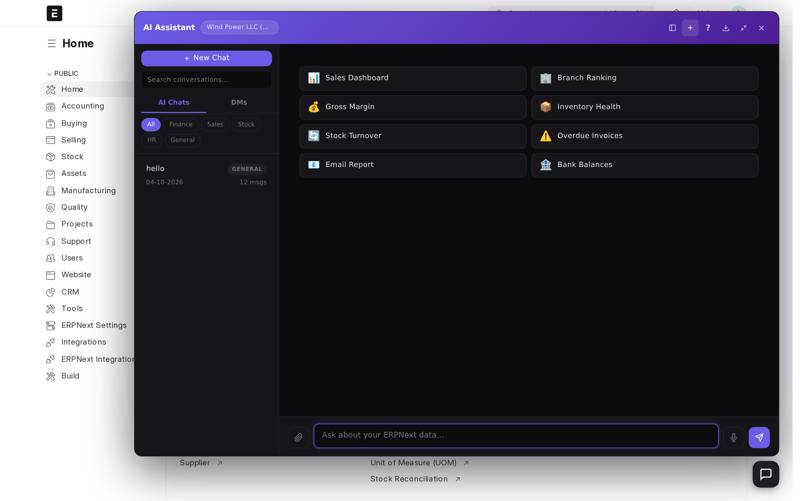
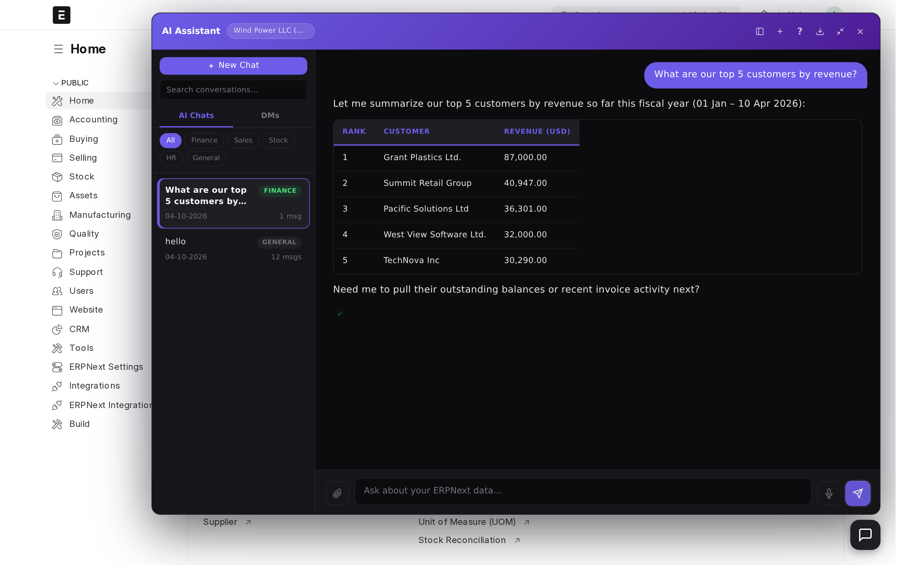
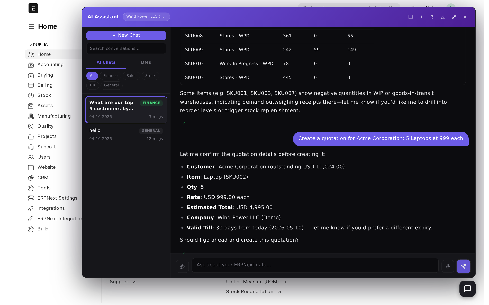
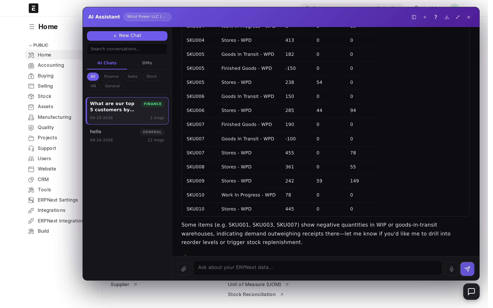
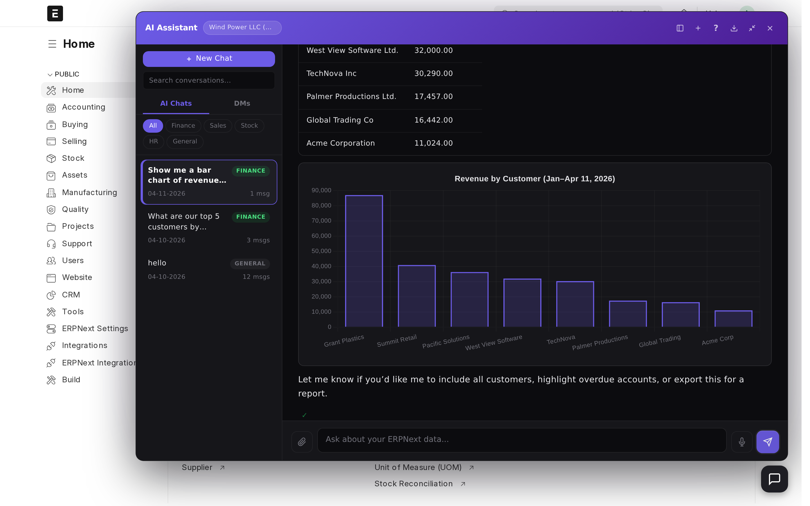
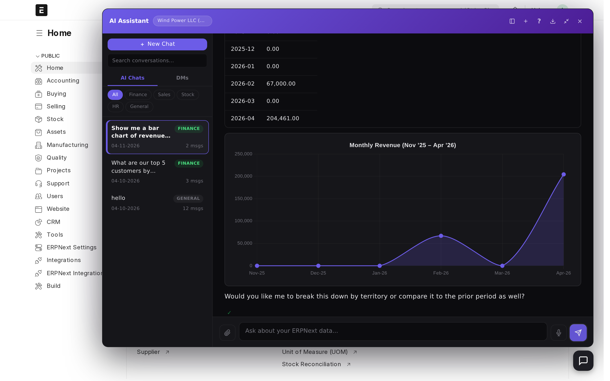
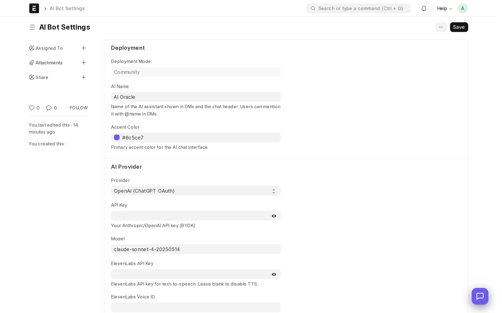

# ERPNext Copilot

An AI-powered assistant for ERPNext — chat with your ERP in plain English.

Ask business questions, create documents, run reports, and automate tasks through a conversational interface built right into ERPNext Desk.

<p align="center">
  
</p>

## Screenshots

<table>
<tr>
<td width="50%">

<p align="center"><em>Quick-access dashboard with report shortcuts</em></p>
</td>
<td width="50%">

<p align="center"><em>"Who are our top 5 customers?"</em></p>
</td>
</tr>
<tr>
<td width="50%">

<p align="center"><em>Create documents with natural language</em></p>
</td>
<td width="50%">

<p align="center"><em>Real-time stock levels across warehouses</em></p>
</td>
</tr>
<tr>
<td width="50%">

<p align="center"><em>Bar charts — revenue by customer</em></p>
</td>
<td width="50%">

<p align="center"><em>Line charts — monthly revenue trends</em></p>
</td>
</tr>
</table>

## What It Does

| For | Examples |
|---|---|
| **Employees** | "What's my leave balance?" / "Create a quotation for Acme Corp, 10 units of Widget A" |
| **Managers** | "Show me P&L for last quarter" / "List overdue invoices over 10,000" |
| **Finance** | "What's our bank balance?" / "Compare sales: Branch A vs Branch B this month" |
| **IT/Admins** | One-time setup, per-user permissions enforced automatically, full audit trail |

## Features

- **40+ AI Tools** — Accounting, HR, Stock, Sales, Purchasing, CRM, Projects, Assets, and Core CRUD
- **Natural Language SQL** — AI writes complex queries (JOINs, aggregates, GROUP BY) for you
- **Permission-Aware** — Every action checked against ERPNext's role-based permissions
- **Scheduled Tasks** — Recurring reports, reminders ("Email me sales summary every Monday at 8am")
- **Direct Messages** — User-to-user DMs with @AI mentions
- **Multi-Provider** — OpenAI (ChatGPT OAuth) and Anthropic Claude supported
- **Live Context** — Company snapshot (top customers, items, overdue alerts) injected into every conversation
- **Fuzzy Matching** — Multi-stage customer/item search (exact, partial, word-by-word)
- **Real-time Streaming** — Responses stream via Socket.IO with thinking indicators
- **Full Audit Trail** — Every tool call logged with input, output, status, and execution time

## Security

- **Permission Guard** — Every tool checked against ERPNext's role-based permissions per user
- **Input Sanitizer** — Blocked DocTypes (User, Role, System Settings), blocked fields (password, api_key), string length limits
- **Prompt Defense** — 19 regex patterns detecting prompt injection attempts
- **Rate Limiter** — Per-user per-minute (10) and per-day (200) limits via Redis
- **Field Whitelisting** — Per-DocType field access control for the AI

## Architecture

```
User (ERPNext Desk)
  -> Chat Widget (JS/Socket.IO)
    -> API Layer (chat.py)
      -> Background Worker (frappe.enqueue)
        -> Orchestrator
          -> System Prompt + Live Context
          -> ChatGPT API (OAuth) or Anthropic API
            -> Tool Calls (40+ tools)
              -> Permission Guard -> Sanitizer -> Execute -> Audit Log
            -> Stream response back via Socket.IO
```

## Tech Stack

- **Backend:** Python 3.10+, Frappe 15, ERPNext 15
- **AI Providers:** OpenAI ChatGPT (OAuth PKCE), Anthropic Claude (API key)
- **Database:** MariaDB (via Frappe ORM + optional direct SQL)
- **Realtime:** Frappe Socket.IO
- **Cache/Queue:** Redis (context caching, rate limiting, background jobs)
- **Frontend:** Vanilla JS + jQuery (Frappe Desk integration)

## Installation

```bash
# Get the app
bench get-app https://github.com/byt3crafter/erpnext-copilot.git

# Install on your site
bench --site your-site.localhost install-app erpnext_ai_bots

# Run migrations
bench --site your-site.localhost migrate

# Build frontend assets
bench build --app erpnext_ai_bots

# Restart
bench restart
```

## Configuration

1. Go to **AI Bot Settings** in ERPNext
2. Choose your AI provider:
   - **OpenAI (ChatGPT OAuth):** Click "Connect ChatGPT Account" for OAuth setup
   - **Anthropic Claude:** Enter your API key (BYOK)
3. Optionally configure:
   - Accent color for the chat widget
   - Database credentials (for direct SQL queries)
   - Rate limits per user
   - Field whitelists per DocType
4. The chat bubble will appear on all ERPNext pages

<p align="center">
  
  <br><em>One-page setup — pick your provider and you're ready to go</em>
</p>

## Tools Overview

| Category | Tools | Examples |
|---|---|---|
| **Core** | get_document, get_list, create_document, update_document, submit_document, run_report, raw_sql, frappe_api, send_email | CRUD on any DocType, run any report, execute SQL |
| **Accounting** | trial_balance, outstanding_invoices, bank_balances, profit_and_loss, journal_entry, account_balance, general_ledger, payment_entry | "Show me P&L for Q1" / "What's outstanding from Customer X?" |
| **HR** | leave_balance, leave_application, salary_slip, attendance, employee_info | "What's my leave balance?" / "Apply for 3 days leave" |
| **Stock** | stock_balance, stock_entry, warehouse_summary, item_info, reorder_levels | "Stock level of Widget A across all warehouses" |
| **Sales** | pipeline, quotation, sales_orders, customer_info, revenue_summary | "Create a quotation for 10 units" / "Top 10 customers this year" |
| **Purchasing** | purchase_order, purchase_invoice, supplier_info, create_supplier | "List pending purchase orders" |
| **CRM** | lead, opportunity | "Show open opportunities over 50,000" |
| **Projects** | project, task | "What tasks are overdue?" |
| **Assets** | asset | "List all assets in the main office" |
| **Meta** | spawn_subagent, schedule_task, saved_report | Complex multi-step tasks, recurring reports |

## Contributing

We welcome contributions! Please see [CONTRIBUTING.md](CONTRIBUTING.md) for guidelines.

## License

[MIT License](license.txt) - Copyright (c) 2026 Ludovic Micinthe

## Author

**Ludovic Micinthe**
- Email: dovik@micinthe.com
- GitHub: [@byt3crafter](https://github.com/byt3crafter)
